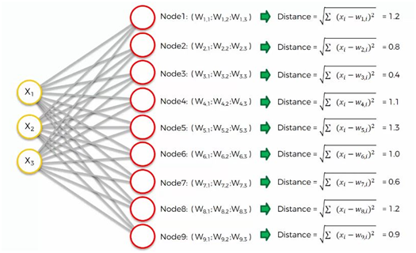
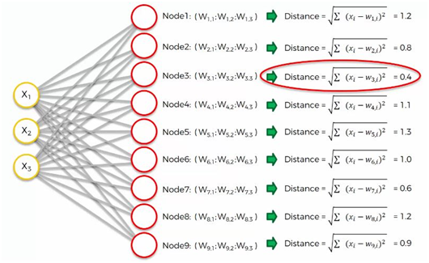
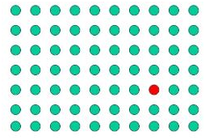
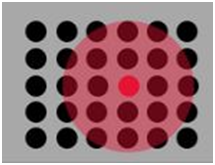
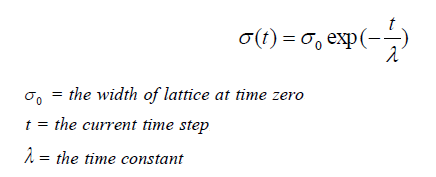
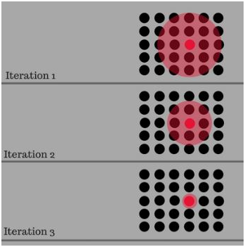

# Self Organization Maps Network Architecture?

Pour les besoins, nous discuterons d'un SOM à deux dimensions. Le réseau est créé à partir d'un réseau 2D de « nœuds », dont chacun est entièrement connecté à la couche d'entrée. La figure ci-dessous montre un très petit réseau Kohonen de 4 X 4 nœuds connectés à la couche d'entrée (en vert) représentant un vecteur bidimensionnel.

Chaque nœud a une position topologique spécifique (une coordonnée x, y dans le réseau) et contient un vecteur de poids de même dimension que les vecteurs d'entrée. C'est-à-dire, si les données d'apprentissage sont constituées de vecteurs, V, de n dimensions : 
<code>V1, V2, V3…Vn</code>

Ensuite, chaque nœud contiendra un vecteur de poids correspondant W, de n dimensions : 

<code>W1, W2, W3…Wn</code>

## Comment fonctionnent les cartes d'auto-organisation ?

### Présentation de l'algorithme d'apprentissage

Un SOM n'a pas besoin de spécifier une sortie cible contrairement à de nombreux autres types de réseau. Au lieu de cela, lorsque les poids des nœuds correspondent au vecteur d'entrée, cette zone du réseau est sélectivement optimisée pour ressembler plus étroitement aux données de la classe dont le vecteur d'entrée est membre. A partir d'une distribution initiale de poids aléatoires, et sur de nombreuses itérations, le SOM finit par s'installer dans une carte de zones stables. Chaque zone est en fait un classificateur d'entités, vous pouvez donc considérer la sortie graphique comme un type de carte d'entités de l'espace d'entrée.

L'entrainement se déroule en plusieurs étapes et en plusieurs itérations :

1. Les poids de chaque nœud sont initialisés.
   
2. Un vecteur est choisi au hasard dans l'ensemble des données d'apprentissage et présenté au réseau.
   
3. Chaque nœud est examiné pour calculer les poids qui ressemblent le plus au vecteur d'entrée. Le nœud gagnant est communément appelé Best Matching Unit (BMU).
   
4. Le rayon du voisinage de la BMU est maintenant calculé. Il s'agit d'une valeur qui commence en grand, généralement définie sur le « rayon » du réseau, mais diminue à chaque pas de temps. Tous les nœuds trouvés dans ce rayon sont réputés être à l'intérieur du voisinage de la BMU.
   
5. Les poids de chaque nœud voisin (les nœuds trouvés à l'étape 4) sont ajustés pour les rendre plus semblables au vecteur d'entrée. Plus un nœud est proche de la BMU ; plus ses poids s'altèrent.
   
6. Répétez l'étape 2 pour N itérations.

### Algorithme d'apprentissage dans les détails.

Il est maintenant temps pour nous d'apprendre comment les SOM apprennent. Es-tu prêt? Commençons. Ici, nous avons une carte auto-organisatrice très basique.

Nos vecteurs d'entrée représentent trois caractéristiques(features) et nous avons neuf nœuds de sortie.

Cela étant dit, cela pourrait vous dérouter de voir comment cet exemple montre trois nœuds d'entrée produisant neuf nœuds de sortie. Ne soyez pas intrigué par cela. Les trois nœuds d'entrée représentent trois colonnes (dimensions) dans l'ensemble de données, mais chacune de ces colonnes peut contenir des milliers de lignes. Les nœuds de sortie dans un SOM sont toujours bidimensionnels.

Maintenant, ce que nous allons faire, c'est transformer ce SOM en un ensemble d'entrées qui vous serait plus familier lorsque nous avons discuté des méthodes d'apprentissage automatique supervisé (réseaux de neurones artificiels, convolutifs et récurrents) dans les chapitres précédents.

Considérez la structure d'auto-organisation qui a 3 nœuds d'entrée visibles et 9 sorties qui sont connectées directement à l'entrée comme indiqué ci-dessous fig.

Nos valeurs de nœuds d'entrée sont :
<pre>
    <code>
        x1 = 0.7
        x2 = 0.6
        x3 = 0.9
    </code>
</pre>
Voyons maintenant chaque étape en détail.

#### Step 1: Initializing the Weights

Maintenant, prenons le nœud de sortie le plus haut et concentrons-nous sur ses connexions avec les nœuds d'entrée. Comme vous pouvez le voir, une pondération est attribuée à chacune de ces connexions.

Encore une fois, le mot «**poids**» a ici un tout autre sens que celui des réseaux de neurones artificiels et convolutifs. Par exemple, avec les réseaux de neurones artificiels, nous avons multiplié la valeur du nœud d'entrée par le poids et, enfin, avons appliqué une fonction d'activation. Avec les **SOM**, en revanche, il n'y a pas de fonction d'activation.

Les poids ne sont pas séparés des nœuds ici. Dans un SOM, les poids appartiennent au nœud de sortie lui-même. Au lieu d'être le résultat de l'addition des poids, le nœud de sortie d'un SOM contient les poids en tant que coordonnées. Portant ces poids, il essaie sournoisement de se frayer un chemin dans l'espace d'entrée.

Dans cet exemple, nous avons un jeu de données 3D et chacun des nœuds d'entrée représente une coordonnée x. Le SOM les compresserait en un seul nœud de sortie qui porte trois poids. Si nous avons affaire à un ensemble de données à 20 dimensions, le nœud de sortie, dans ce cas, porterait 20 coordonnées de poids.

Chacun de ces nœuds de sortie ne fait pas exactement partie de l'espace d'entrée, mais essaie néanmoins de s'y intégrer, en développant des lieux imaginaires pour eux-mêmes.

Nous avons initialisé aléatoirement les valeurs des poids (proche de 0 mais pas de 0).

#### Étape 2 : Calcul de la meilleure unité correspondante

La prochaine étape consiste à parcourir notre ensemble de données. Pour chacune des lignes de notre ensemble de données, nous essaierons de trouver le nœud le plus proche.

Disons que nous prenons la ligne numéro 1 et que nous extrayons sa valeur pour chacune des trois colonnes que nous avons. Nous voudrons ensuite trouver lequel de nos nœuds de sortie est le plus proche de cette ligne.

Pour déterminer la meilleure unité d'appariement, une méthode consiste à parcourir tous les nœuds et à calculer la distance euclidienne entre le vecteur de poids de chaque nœud et le vecteur d'entrée actuel. Le nœud avec un vecteur de poids le plus proche du vecteur d'entrée est étiqueté comme **BMU**.

La distance euclidienne est donnée par :

Où X est le vecteur d'entrée actuel et W est le vecteur de poids du nœud.

Calculons la meilleure unité de correspondance à l'aide de la formule de distance.

Pour les 1ers nœuds :

Pour le 2ème nœuds :

Pour les 3ème nœuds :

De même, nous calculons tous les nœuds restants de la même manière que vous pouvez le voir ci-dessous.

Puisque nous avons calculé toutes les valeurs de Noeuds respectifs. Il est maintenant temps de calculer la meilleure unité de correspondance.

Comme on peut le voir, le nœud numéro 3 est le plus proche avec une distance de 0,4. Nous appellerons ce nœud notre BMU (**best-matching unit**).

#### Que se passe-t-il ensuite ?

Pour comprendre cette prochaine partie, nous devrons utiliser un plus grand SOM.

Soi-disant, vous comprenez maintenant quelle est la différence entre les poids dans le contexte SOM par rapport à celui auquel nous étions habitués lorsque nous traitions de l'apprentissage automatique supervisé.

Le cercle rouge dans la figure ci-dessus représente le BMU de cette carte. Maintenant, le nouveau SOM devra mettre à jour ses poids afin qu'il soit encore plus proche de la première ligne de notre ensemble de données. La raison pour laquelle nous en avons besoin est que nos nœuds d'entrée ne peuvent pas être mis à jour, alors que nous avons le contrôle de nos nœuds de sortie.

En termes simples, notre SOM se rapproche du point de données en étirant le BMU vers lui. L'objectif final est d'aligner notre carte sur l'ensemble de données comme nous le voyons dans l'image à l'extrême droite.

#### Étape 3 : Calcul de la taille du quartier autour du BMU

C'est là que les choses commencent à devenir plus intéressantes ! À chaque itération, une fois la BMU déterminée, l'étape suivante consiste à calculer lesquels des autres nœuds se trouvent dans le voisinage de la BMU. Tous ces nœuds verront leurs vecteurs de poids modifiés à l'étape suivante. Alors comment fait-on ? Eh bien, ce n'est pas trop difficile… d'abord, vous calculez quel devrait être le rayon du voisinage et ensuite c'est une simple application du bon vieux Pythagore pour déterminer si chaque nœud est dans la distance radiale ou non.

La figure montre un exemple de la taille d'un quartier typique proche du début de l'entrainement.

Vous pouvez voir que le quartier illustré ci-dessus est centré autour du BMU (point rouge) et englobe la plupart des autres nœuds et le rayon d'affichage du cercle.

La taille du voisinage autour de la BMU diminue avec une fonction de décroissance exponentielle. Il rétrécit à chaque itération jusqu'à atteindre juste le BMU

<code> Where t = 0, 1, 2, 3…. </code>

La figure ci-dessous montre comment le voisinage diminue au fil du temps après chaque itération

