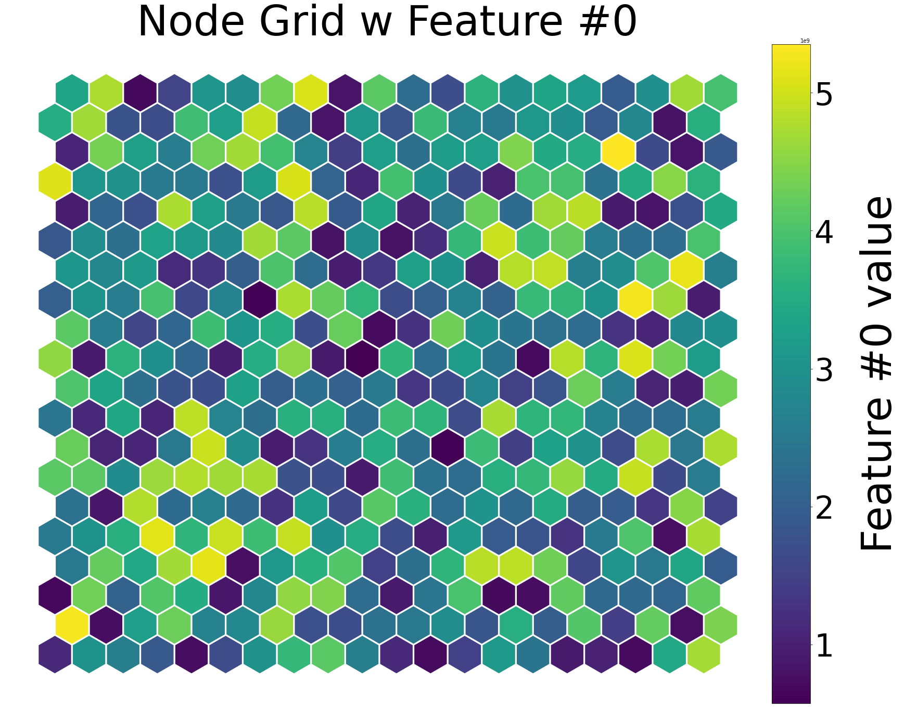
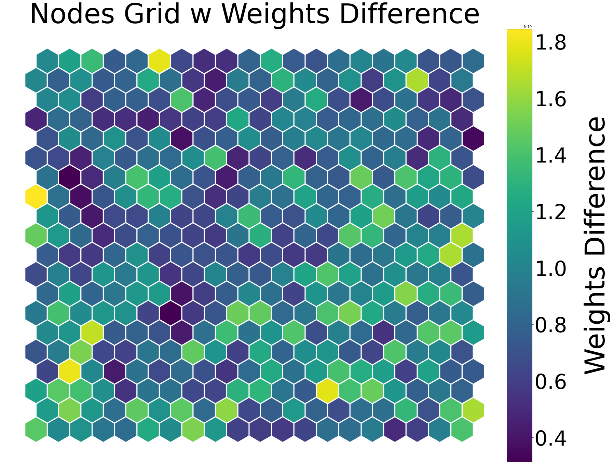
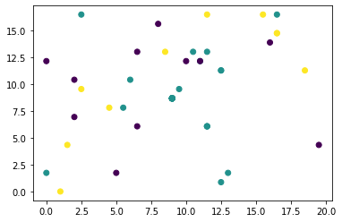

### Présenté par:

### 														CAMARA Laby Damaro

### 														Malek Rafrafi


## Application De SOM En Python

Pour comparer la sécurité des compagnies aériennes, nous avons dû regrouper les neurones de sortie de cartes auto-organisatrice(SOM) à l'aide d'une technique d'apprentissage automatique non supervisée (kmeans) qui regroupe les compagnies aériennes en différents groupes. Ces groupes sont:

1. Safe airlines (Compagnies aériennes sûres) <- 0.
2. Doubtfully safe airlines (Compagnies aériennes douteuses) <- 1.
3. Risky airlines (Compagnies aériennes risquées) <- 2. 

### Installation de SOM


```python
#!pip install --user -U  SimpSOM
```

### Importation des packages


```python
import pandas as pd
import SimpSOM as sps
from sklearn.cluster import KMeans
import numpy as np
```

### Téléchargement du dataset

Nous sommes allés télécharger le dataset des compagnies aériennes sur Kaggle sur lien ci-dessous:

[https://www.kaggle.com/danoozy44/airline-safety](https://www.kaggle.com/danoozy44/airline-safety)

### Création de dataset


```python
df = pd.read_csv("airline-safety.csv")
df.head()
```


<div>
<style scoped>
    .dataframe tbody tr th:only-of-type {
        vertical-align: middle;
    }

    .dataframe tbody tr th {
        vertical-align: top;
    }
    
    .dataframe thead th {
        text-align: right;
    }
</style>
<table border="1" class="dataframe">
  <thead>
    <tr style="text-align: right;">
      <th></th>
      <th>airline</th>
      <th>avail_seat_km_per_week</th>
      <th>incidents_85_99</th>
      <th>fatal_accidents_85_99</th>
      <th>fatalities_85_99</th>
      <th>incidents_00_14</th>
      <th>fatal_accidents_00_14</th>
      <th>fatalities_00_14</th>
    </tr>
  </thead>
  <tbody>
    <tr>
      <th>0</th>
      <td>Aer Lingus</td>
      <td>320906734</td>
      <td>2</td>
      <td>0</td>
      <td>0</td>
      <td>0</td>
      <td>0</td>
      <td>0</td>
    </tr>
    <tr>
      <th>1</th>
      <td>Aeroflot*</td>
      <td>1197672318</td>
      <td>76</td>
      <td>14</td>
      <td>128</td>
      <td>6</td>
      <td>1</td>
      <td>88</td>
    </tr>
    <tr>
      <th>2</th>
      <td>Aerolineas Argentinas</td>
      <td>385803648</td>
      <td>6</td>
      <td>0</td>
      <td>0</td>
      <td>1</td>
      <td>0</td>
      <td>0</td>
    </tr>
    <tr>
      <th>3</th>
      <td>Aeromexico*</td>
      <td>596871813</td>
      <td>3</td>
      <td>1</td>
      <td>64</td>
      <td>5</td>
      <td>0</td>
      <td>0</td>
    </tr>
    <tr>
      <th>4</th>
      <td>Air Canada</td>
      <td>1865253802</td>
      <td>2</td>
      <td>0</td>
      <td>0</td>
      <td>2</td>
      <td>0</td>
      <td>0</td>
    </tr>
  </tbody>
</table>
</div>


### Data préprocessing


```python
df.describe()
```


<div>
<style scoped>
    .dataframe tbody tr th:only-of-type {
        vertical-align: middle;
    }

    .dataframe tbody tr th {
        vertical-align: top;
    }
    
    .dataframe thead th {
        text-align: right;
    }
</style>
<table border="1" class="dataframe">
  <thead>
    <tr style="text-align: right;">
      <th></th>
      <th>avail_seat_km_per_week</th>
      <th>incidents_85_99</th>
      <th>fatal_accidents_85_99</th>
      <th>fatalities_85_99</th>
      <th>incidents_00_14</th>
      <th>fatal_accidents_00_14</th>
      <th>fatalities_00_14</th>
    </tr>
  </thead>
  <tbody>
    <tr>
      <th>count</th>
      <td>5.600000e+01</td>
      <td>56.000000</td>
      <td>56.000000</td>
      <td>56.000000</td>
      <td>56.000000</td>
      <td>56.000000</td>
      <td>56.000000</td>
    </tr>
    <tr>
      <th>mean</th>
      <td>1.384621e+09</td>
      <td>7.178571</td>
      <td>2.178571</td>
      <td>112.410714</td>
      <td>4.125000</td>
      <td>0.660714</td>
      <td>55.517857</td>
    </tr>
    <tr>
      <th>std</th>
      <td>1.465317e+09</td>
      <td>11.035656</td>
      <td>2.861069</td>
      <td>146.691114</td>
      <td>4.544977</td>
      <td>0.858684</td>
      <td>111.332751</td>
    </tr>
    <tr>
      <th>min</th>
      <td>2.593733e+08</td>
      <td>0.000000</td>
      <td>0.000000</td>
      <td>0.000000</td>
      <td>0.000000</td>
      <td>0.000000</td>
      <td>0.000000</td>
    </tr>
    <tr>
      <th>25%</th>
      <td>4.740362e+08</td>
      <td>2.000000</td>
      <td>0.000000</td>
      <td>0.000000</td>
      <td>1.000000</td>
      <td>0.000000</td>
      <td>0.000000</td>
    </tr>
    <tr>
      <th>50%</th>
      <td>8.029089e+08</td>
      <td>4.000000</td>
      <td>1.000000</td>
      <td>48.500000</td>
      <td>3.000000</td>
      <td>0.000000</td>
      <td>0.000000</td>
    </tr>
    <tr>
      <th>75%</th>
      <td>1.847239e+09</td>
      <td>8.000000</td>
      <td>3.000000</td>
      <td>184.250000</td>
      <td>5.250000</td>
      <td>1.000000</td>
      <td>83.250000</td>
    </tr>
    <tr>
      <th>max</th>
      <td>7.139291e+09</td>
      <td>76.000000</td>
      <td>14.000000</td>
      <td>535.000000</td>
      <td>24.000000</td>
      <td>3.000000</td>
      <td>537.000000</td>
    </tr>
  </tbody>
</table>
</div>


```python
train = np.array(df.iloc[:, 1:])
```

### Entrainement du modèle Kohonen


```python
net = sps.somNet(20, 20, train, PBC=True)
net.train(0.01, 200)
net.save("filename_weights")
net.nodes_graph(colnum=0)
```

    Periodic Boundary Conditions active.
    The weights will be initialised randomly.
    Training SOM... done!



    


```python
net.diff_graph()
```


​    

​    


```python
import matplotlib.pyplot as plt
```


```python
kmeans = KMeans(n_clusters=3, random_state=0).fit(prj)
df["clusters"]=kmeans.labels_
```


```python
prj=np.array(net.project(train))
plt.scatter(prj.T[0],prj.T[1], c=df.clusters)
plt.show()
```


​    

​    


### Les compagnies aériennes sûrs


```python
df[df["clusters"]==0].head()
```


<div>
<style scoped>
    .dataframe tbody tr th:only-of-type {
        vertical-align: middle;
    }

    .dataframe tbody tr th {
        vertical-align: top;
    }
    
    .dataframe thead th {
        text-align: right;
    }
</style>
<table border="1" class="dataframe">
  <thead>
    <tr style="text-align: right;">
      <th></th>
      <th>airline</th>
      <th>avail_seat_km_per_week</th>
      <th>incidents_85_99</th>
      <th>fatal_accidents_85_99</th>
      <th>fatalities_85_99</th>
      <th>incidents_00_14</th>
      <th>fatal_accidents_00_14</th>
      <th>fatalities_00_14</th>
      <th>clusters</th>
    </tr>
  </thead>
  <tbody>
    <tr>
      <th>4</th>
      <td>Air Canada</td>
      <td>1865253802</td>
      <td>2</td>
      <td>0</td>
      <td>0</td>
      <td>2</td>
      <td>0</td>
      <td>0</td>
      <td>0</td>
    </tr>
    <tr>
      <th>8</th>
      <td>Alaska Airlines*</td>
      <td>965346773</td>
      <td>5</td>
      <td>0</td>
      <td>0</td>
      <td>5</td>
      <td>1</td>
      <td>88</td>
      <td>0</td>
    </tr>
    <tr>
      <th>15</th>
      <td>Cathay Pacific*</td>
      <td>2582459303</td>
      <td>0</td>
      <td>0</td>
      <td>0</td>
      <td>2</td>
      <td>0</td>
      <td>0</td>
      <td>0</td>
    </tr>
    <tr>
      <th>16</th>
      <td>China Airlines</td>
      <td>813216487</td>
      <td>12</td>
      <td>6</td>
      <td>535</td>
      <td>2</td>
      <td>1</td>
      <td>225</td>
      <td>0</td>
    </tr>
    <tr>
      <th>27</th>
      <td>Iberia</td>
      <td>1173203126</td>
      <td>4</td>
      <td>1</td>
      <td>148</td>
      <td>5</td>
      <td>0</td>
      <td>0</td>
      <td>0</td>
    </tr>
  </tbody>
</table>
</div>


### Les compagnies aériennes douteuses


```python
df[df["clusters"]==1].head()
```


<div>
<style scoped>
    .dataframe tbody tr th:only-of-type {
        vertical-align: middle;
    }

    .dataframe tbody tr th {
        vertical-align: top;
    }
    
    .dataframe thead th {
        text-align: right;
    }
</style>
<table border="1" class="dataframe">
  <thead>
    <tr style="text-align: right;">
      <th></th>
      <th>airline</th>
      <th>avail_seat_km_per_week</th>
      <th>incidents_85_99</th>
      <th>fatal_accidents_85_99</th>
      <th>fatalities_85_99</th>
      <th>incidents_00_14</th>
      <th>fatal_accidents_00_14</th>
      <th>fatalities_00_14</th>
      <th>clusters</th>
    </tr>
  </thead>
  <tbody>
    <tr>
      <th>0</th>
      <td>Aer Lingus</td>
      <td>320906734</td>
      <td>2</td>
      <td>0</td>
      <td>0</td>
      <td>0</td>
      <td>0</td>
      <td>0</td>
      <td>1</td>
    </tr>
    <tr>
      <th>1</th>
      <td>Aeroflot*</td>
      <td>1197672318</td>
      <td>76</td>
      <td>14</td>
      <td>128</td>
      <td>6</td>
      <td>1</td>
      <td>88</td>
      <td>1</td>
    </tr>
    <tr>
      <th>2</th>
      <td>Aerolineas Argentinas</td>
      <td>385803648</td>
      <td>6</td>
      <td>0</td>
      <td>0</td>
      <td>1</td>
      <td>0</td>
      <td>0</td>
      <td>1</td>
    </tr>
    <tr>
      <th>3</th>
      <td>Aeromexico*</td>
      <td>596871813</td>
      <td>3</td>
      <td>1</td>
      <td>64</td>
      <td>5</td>
      <td>0</td>
      <td>0</td>
      <td>1</td>
    </tr>
    <tr>
      <th>7</th>
      <td>Air New Zealand*</td>
      <td>710174817</td>
      <td>3</td>
      <td>0</td>
      <td>0</td>
      <td>5</td>
      <td>1</td>
      <td>7</td>
      <td>1</td>
    </tr>
  </tbody>
</table>
</div>


### Les compagnies aériennes à risquées


```python
df[df["clusters"]==2].head()
```


<div>
<style scoped>
    .dataframe tbody tr th:only-of-type {
        vertical-align: middle;
    }

    .dataframe tbody tr th {
        vertical-align: top;
    }
    
    .dataframe thead th {
        text-align: right;
    }
</style>

<table border="1" class="dataframe">
  <thead>
    <tr style="text-align: right;">
      <th></th>
      <th>airline</th>
      <th>avail_seat_km_per_week</th>
      <th>incidents_85_99</th>
      <th>fatal_accidents_85_99</th>
      <th>fatalities_85_99</th>
      <th>incidents_00_14</th>
      <th>fatal_accidents_00_14</th>
      <th>fatalities_00_14</th>
      <th>clusters</th>
    </tr>
  </thead>
  <tbody>
    <tr>
      <th>5</th>
      <td>Air France</td>
      <td>3004002661</td>
      <td>14</td>
      <td>4</td>
      <td>79</td>
      <td>6</td>
      <td>2</td>
      <td>337</td>
      <td>2</td>
    </tr>
    <tr>
      <th>6</th>
      <td>Air India*</td>
      <td>869253552</td>
      <td>2</td>
      <td>1</td>
      <td>329</td>
      <td>4</td>
      <td>1</td>
      <td>158</td>
      <td>2</td>
    </tr>
    <tr>
      <th>11</th>
      <td>American*</td>
      <td>5228357340</td>
      <td>21</td>
      <td>5</td>
      <td>101</td>
      <td>17</td>
      <td>3</td>
      <td>416</td>
      <td>2</td>
    </tr>
    <tr>
      <th>14</th>
      <td>British Airways*</td>
      <td>3179760952</td>
      <td>4</td>
      <td>0</td>
      <td>0</td>
      <td>6</td>
      <td>0</td>
      <td>0</td>
      <td>2</td>
    </tr>
    <tr>
      <th>19</th>
      <td>Delta / Northwest*</td>
      <td>6525658894</td>
      <td>24</td>
      <td>12</td>
      <td>407</td>
      <td>24</td>
      <td>2</td>
      <td>51</td>
      <td>2</td>
    </tr>
  </tbody>
</table>
</div>


```python
print('{:.2f} % des compagnies sont sûrs'.format(((len(df[df["clusters"]==0])/len(df))*100)))
```

    19.64 % des compagnies sont sûrs


```python
print('{:.2f} % des compagnies sont douteuses'.format(((len(df[df["clusters"]==1])/len(df))*100)))
```

    62.50 % des compagnies sont douteuses


```python
print('{:.2f} % des compagnies sont risquées'.format(((len(df[df["clusters"]==2])/len(df))*100)))
```

    17.86 % des compagnies sont risquées


## Résumé

L'utilisation des SOM suit les étapes suivantes dans la formation du réseau:

1. Initialisez les poids des neurones cachés à de petites valeurs aléatoires ou utilisez l'initialisation du poids PCA.
2. Alimentez la ligne xi à la couche d'entrée.
3. Itérer à travers chaque neurone dans la couche cachée et trouver le BMU et ses unités voisines.
4. Appliquez la mise à jour du poids au BMU et à ses neurones voisins.
5. Réduire la fonction de voisinage.
6. Répétez les étapes 2 à 5 jusqu'à ce que la limite d'itération atteigne ou que le modèle converge.

## Réssources
1. The Ultimate guide to Self organizing maps (SOM’s) by SuperDataScience Team. link <br>
   [https://www.superdatascience.com/blogs/the-ultimate-guide-to-self-organizing-maps-soms](https://www.superdatascience.com/blogs/the-ultimate-guide-to-self-organizing-maps-soms)
   
2. Analyzing Climate Patterns with Self-Organizing Maps (SOMs) by Haihan Lan link <br>
 [https://towardsdatascience.com/analyzing-climate-patterns-with-self-organizing-maps-soms-8d4ef322705b](https://towardsdatascience.com/analyzing-climate-patterns-with-self-organizing-maps-soms-8d4ef322705b)<br/>
    
3. An introduction to self organizing maps by Umut Asan and Secil Ercan link <br>
[https://www.researchgate.net/publication/263084866_An_Introduction_to_Self-Organizing_Maps](https://www.researchgate.net/publication/263084866_An_Introduction_to_Self-Organizing_Maps)


4. Reach our site <br/>[https://www.dalicodes.com/](https://www.dalicodes.com/)


```python

```
